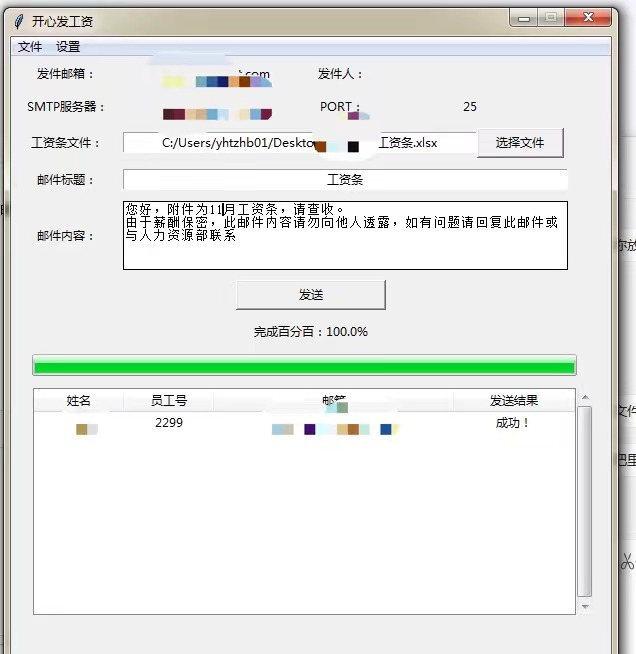
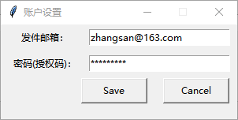
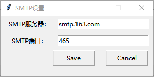
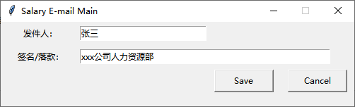

# salary_email

此项目为一个简易的工资条邮箱发送GUI小工具，支持读取excel文件，批量发送工资条邮件。

程序入口： SalaryEmailRun.py

使用pyinstaller等打包工具打包为可执行程序使用
#### 打包成exe命令
```
pyinstaller --icon=./icon.ico --noconsole -p 自定义路径 -D SalaryEmailRun.py 
```
### 工资条表格说明
支持的文件格式为xls,xlsx文件，文件第一行为工资条事项，第一列为姓名，最后一列为邮箱地址，中间列可自行随意增减。如：


### 主界面


### 发件邮箱登陆设置


### 邮箱smtp设置


### 邮件底部落款设置


